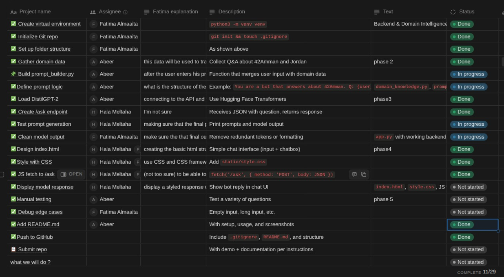

# Chatbot

This project is about creating an AI agent that answers questions about 42Amman and Jordan. It uses DistilGPT
as a pretraind AI model API to answer user questions. The project was divided into subtasks on all team members
equal, and every one worked collaboratively to reach the end goal and more importantly learing new skils. Notion was also utilized to be able track tasks and there completion. The following picture provides an example.

The project was mainly divided into three main section, each of which had several tasks. Everything will be explained thoroghly and concisely in the following sections. 

## Front-end

This part include three main programming languages which are:
- HTML (hypertext markup language)
- CSS (cascaid style sheet)
- JS (javascript)

It is resposible for render a responsive and visually appealing webpage. 

## Back-end

This part include the following pragramming languages, frameworks and libraries which are:
- Python: flask, torch and transformers.

It is responsible for processing the data inserted by the user, filtering it and sending it to DistilGPT (the previously mentioned API).

## Data gathering

This part is conserned with gathering usful data about 42Ammand and Jordan the will be sent to the API in the generated prompt.

## Workflow diagram 

The following diagram shows the flow of work in the provided system